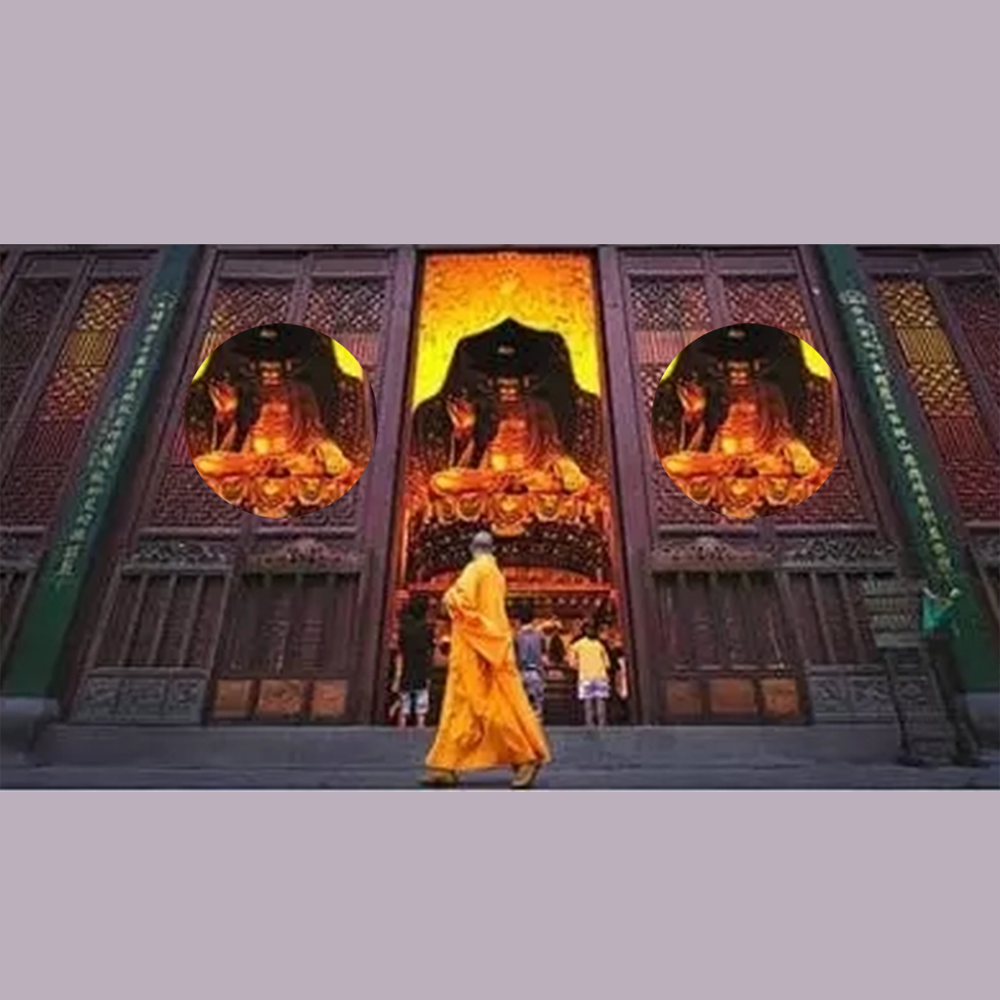

## Welcome to My Temple Etiquette Record 

In daily life, we often see temples, and temples have many rituals that we need to observe and pay attention to. When we want to enter a temple, we need to observe the rituals and requirements of the temple. For example, some temples require people to wear certain clothes, keep quiet and keep their hands clasped. We can record the detailed requirements of each temple to prevent unnecessary troubles. You can organize these records into a list to make it easier for you to understand the temple rituals.

If you have any questions, you can either leave a message or send the questions to our email address.

We will answer them for you in the first time.

### Address: BeatriceArlenexSgPdE@yahoo.com

Thank you!
